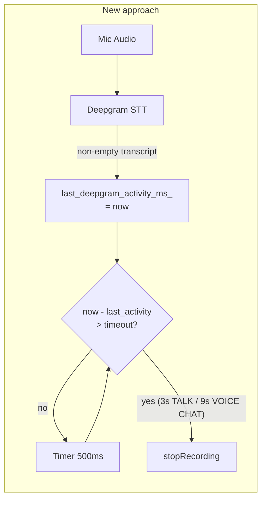

# Replace Amplitude Silence Detection with Deepgram Activity Timeout

## Why

Local amplitude detection (`peak < 0.06f`) is unreliable across different mic setups, background noise levels, and environments. Deepgram's ML-based VAD already determines speech boundaries (configured with `endpointing=1500` and `utterance_end_ms=2000` in [deepgram_client.cpp](src/common/deepgram_client.cpp)). We should use Deepgram's judgment rather than a static amplitude threshold.

## Approach

Use a JUCE `Timer` in `VitalSidePanel` that periodically checks how long it's been since the last meaningful Deepgram transcript. If Deepgram has returned nothing useful (no non-empty transcript, no finalization) for **3 seconds** (TALK) or **9 seconds** (VOICE CHAT), stop recording. No `talk_received_final`_ gating needed — pure inactivity timeout.

## Key changes

### 1. Add timer-based inactivity tracking to VitalSidePanel

In [side_panel.h](src/interface/editor_sections/side_panel.h):

- Make `VitalSidePanel` also inherit from `juce::Timer`
- Add `double last_deepgram_activity_ms`_ member
- Add `timerCallback()` override
- Remove `talk_received_final_` (no longer needed)

### 2. Implement timerCallback logic

In [side_panel.cpp](src/interface/editor_sections/side_panel.cpp):

- `timerCallback()` checks: if `recording_mode_ != kRecordingNone` AND `(Time::getMillisecondCounterHiRes() - last_deepgram_activity_ms_) > timeout`, call `stopRecording()`
- Timeout: 3000ms for `kRecordingTalk`, 9000ms for `kRecordingVoiceChat`
- Timer polls every 500ms

### 3. Update Deepgram transcript callbacks

In both `startTalkRecording()` and `startVoiceChatRecording()`:

- Initialize `last_deepgram_activity_ms_ = Time::getMillisecondCounterHiRes()` before starting (so the clock starts from when recording begins)
- On any non-empty transcript callback (interim or final): update `last_deepgram_activity_ms`_
- Remove all `talk_received_final_` references
- Call `startTimer(500)` after mic capture starts

### 4. Stop passing silence callbacks to MicrophoneCapture

- Pass `nullptr` for `on_silence` in both modes' `startCapture()` calls
- Remove the silence timeout override arg from VOICE CHAT's `startCapture()` call
- In `stopRecording()`: call `stopTimer()`

### 5. Cleanup

- Remove `resetSilenceDetection()` from MicrophoneCapture (added earlier this session, now unused)
- Remove `talk_received_final_` member from side_panel.h
- Amplitude-based silence code in [microphone_capture.cpp](src/common/microphone_capture.cpp) stays but is inert (no callback = no threshold set)

## Data flow

## Timeout values

- **TALK mode**: 3 seconds of no Deepgram activity
- **VOICE CHAT mode**: 9 seconds of no Deepgram activity

