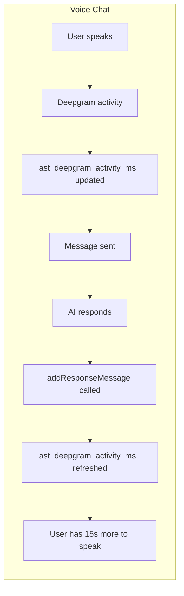

# Voice Chat: Refresh Inactivity on AI Response

## Problem

Currently, voice chat uses a 15-second inactivity timeout based on **Deepgram activity** (non-empty transcripts). When the user sends a message and waits for the AI to respond, Deepgram returns nothing during that wait. If the AI takes 15+ seconds to respond, the user gets cut off before they can hear the response or ask a follow-up.

## Solution

Refresh `last_deepgram_activity_ms_` when the **AI response** is received. That gives the user another 15 seconds to speak after each response.

- **Voice chat**: Inactivity timer resets on (1) Deepgram non-empty transcript, and (2) AI response received.
- **Dictation (TALK)**: Unchanged — still stops immediately on final transcript; no response-based refresh.

## Implementation

Add a single line in [side_panel.cpp](src/interface/editor_sections/side_panel.cpp) inside `addResponseMessage()`:

```cpp
void VitalSidePanel::addResponseMessage(const String& text) {
  if (recording_mode_ == kRecordingVoiceChat)
    last_deepgram_activity_ms_ = Time::getMillisecondCounterHiRes();
  clearThinkingMessage();
  addMessage(text, ChatMessage::kSystem);
}
```

`addResponseMessage` is already called from [full_interface.cpp](src/interface/editor_sections/full_interface.cpp) whenever the API returns a response (single action, multi-action completion, etc.), so no changes there.

## Flow



## Notes

- Grace period (5s) and timeout (15s) remain unchanged.
- Only affects voice chat; recording mode is checked before refreshing.
- No new listener or API surface needed.
